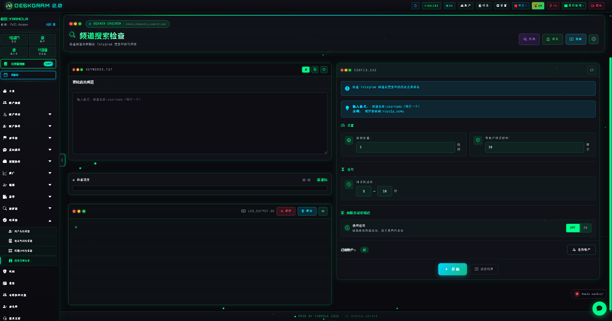
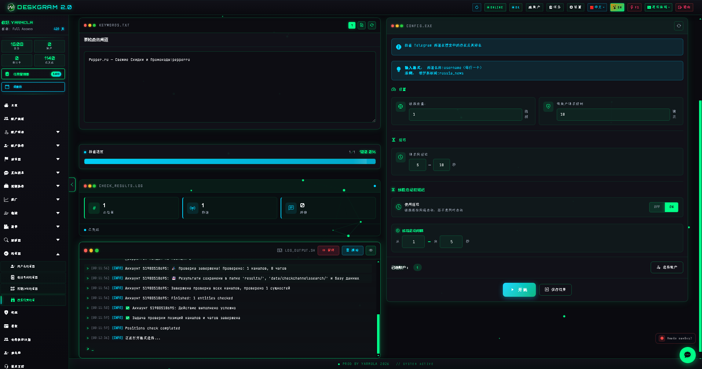
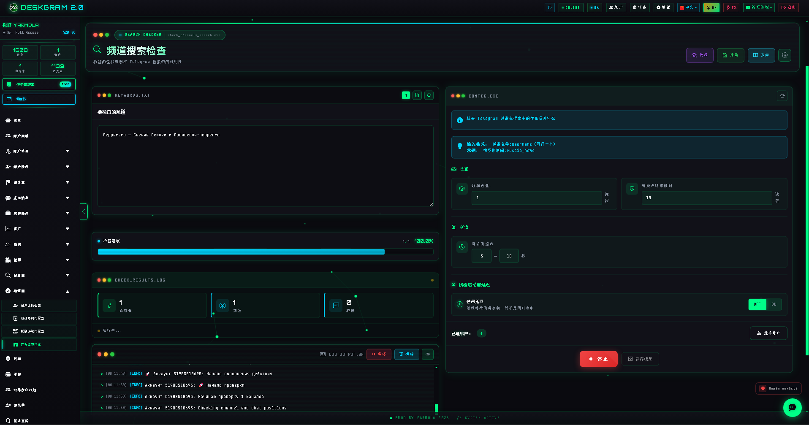
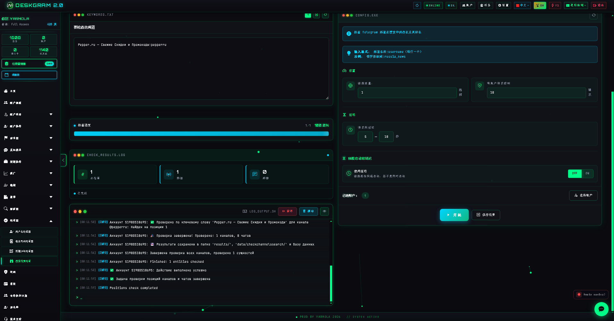

# Deskgram 2 Telegram 搜索可见性检查器

Deskgram 2 的 Telegram 搜索可见性检查器可以在你进入 discovery、comparison 或扩张路线之前，先检查频道和聊天是否真正出现在 Telegram 搜索里。这个模块适合在你不想只靠猜测，而是想先验证搜索可见性的时候使用。

[Deskgram 2 Hub](https://github.com/Deskgram-2/deskgram-2-telegram-automation-zh) · [Website](https://deskgram2.com/) · [Telegram Bot](https://t.me/DG2welcomebot) · [Web Preview](https://deskgram2.com/web-preview?path=%2Fapp-demo%2F&lang=cn)

## 交互式 Web Preview

在浏览器里查看模块界面：[打开 web preview](https://deskgram2.com/web-preview?path=%2Fapp-demo%2Ffunctions%2Fcheck_channels_search&lang=cn)

这样你可以先看搜索格式、统计和账号选择，再决定是否启动可见性检查。

## Screenshots

## 模块概览

| 参数 | 内容 |
|---|---|
| 核心任务 | 检查 Telegram 频道和聊天在搜索里的可见性 |
| 重要模块 | 主列表、格式设置、统计、账号选择器 |
| 适用场景 | discovery 验证、细分市场对比、可见性检查 |
| 相关模块 | 频道搜索、相似频道、评论检查器 |

## 模块能力

- 检查频道和聊天是否出现在 Telegram 搜索中；
- 在下一条 discovery 路线前比较可见性；
- 在 parser 或 engagement 开始前先验证列表；
- 在运行过程中保持统计可见；
- 减少对频道搜索表现的猜测。

## 快速开始

1. 准备频道、聊天或关键词列表。
2. 配置搜索格式和检查设置。
3. 选择要使用的账号。
4. 运行可见性检查并查看结果汇总。
5. 把已验证的列表送入下一个 discovery 或执行层。

## 最适合和哪些模块联动

- [频道搜索](https://github.com/Deskgram-2/telegram-channel-search-deskgram-zh)
- [相似频道](https://github.com/Deskgram-2/telegram-similar-channels-deskgram-zh)
- [频道评论检查器](https://github.com/Deskgram-2/telegram-channel-comments-checker-deskgram-zh)
- [任务管理](https://github.com/Deskgram-2/telegram-task-manager-deskgram-zh)

## 什么时候特别有用

- 当频道在 Telegram 搜索里的可见性会影响下一条路线；
- 当 discovery 应该从搜索已验证的列表开始；
- 当你要更清楚地比较频道或聊天在搜索层里的表现；
- 当 parser 或 engagement 不想浪费在弱可见性目标上。

## 选哪个：搜索可见性检查器还是频道搜索

| 如果你的目标是 | 更适合 |
|---|---|
| 验证频道是否出现在 Telegram 搜索里 | `搜索可见性检查器` |
| 从零开始按关键词找新频道 | [频道搜索](https://github.com/Deskgram-2/telegram-channel-search-deskgram-zh) |
| 在行动前先比较可见性 | `搜索可见性检查器` |
| 向外扩展更大的细分市场地图 | [频道搜索](https://github.com/Deskgram-2/telegram-channel-search-deskgram-zh) |

## Related repositories

- [Deskgram 2 Hub](https://github.com/Deskgram-2/deskgram-2-telegram-automation-zh)
- [频道搜索](https://github.com/Deskgram-2/telegram-channel-search-deskgram-zh)
- [相似频道](https://github.com/Deskgram-2/telegram-similar-channels-deskgram-zh)
- [频道评论检查器](https://github.com/Deskgram-2/telegram-channel-comments-checker-deskgram-zh)
- [任务管理](https://github.com/Deskgram-2/telegram-task-manager-deskgram-zh)

## FAQ

### 可以先在浏览器里看模块吗？

可以。web preview 已经能展示搜索布局、格式设置、统计和账号选择器。

### 这和按关键词搜索新频道一样吗？

不一样。这个模块更适合验证已有列表的搜索可见性，而频道搜索更适合从零开始发现新候选对象。
